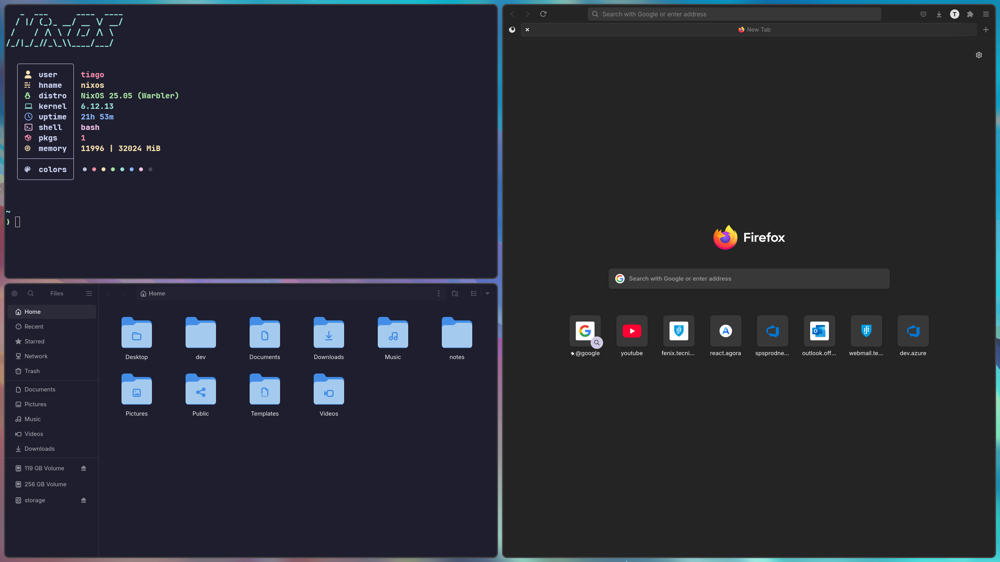
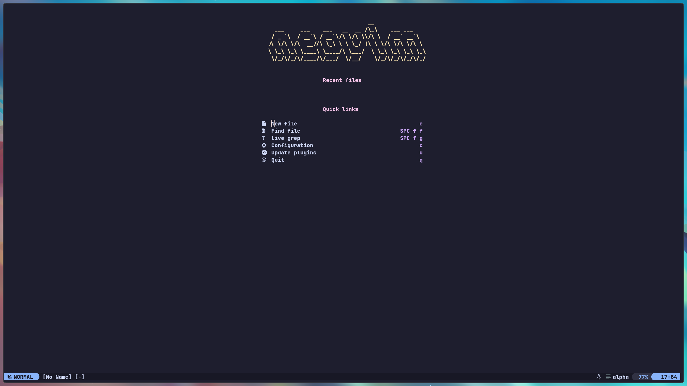

# NixOS Configuration

My personal NixOS system configuration and home-manager dotfiles.

## Overview

This repository contains my NixOS configuration files, including:

- System configuration (NixOS)
- Home configuration (home-manager)
- Development environment setup
- Customized configurations for:
  - Hyprland
  - Neovim (using nixvim)
  - Helix
  - Emacs (kinda)
  - Git
  - And maybe more...

## Screenshots


(no i don't use a bar, but you can find some nice configs online)




## Prerequisites

- NixOS installed
- Git
- home-manager
- Flakes enabled

## Installation

1. Clone this repository:
```bash
git clone https://github.com/peraltaboi/nixos.git
cd nixos-config
```

2. Swap out the hardware-configuration.nix for your own

3. Edit all occurences of "tiago" (my username!) to yours (or not :p)
```bash
# Run this in the nixos directory
find . -type f -exec sed -i 's/tiago/<your-username>/gI' {} +
find . -type f -exec sed -i 's/Tiago[[:space:]]\+Peralta/<your full name (or whatever you want to use)>/gI' {} +
```

4. You should probably change the home/tiago directory to your username too

5. Create a home/<your-username>/code/private.nix file with this format:
```nix
{
  git-email = "your-git-email";
  git-name = "your-git-username";
}
```

6. Create a symlink for the system configuration:
```bash
sudo ln -s $(pwd)/configuration.nix /etc/nixos/configuration.nix
```

7. Build and switch to the new configuration:
```bash
sudo nixos-rebuild switch
```

## Updating

To update all flake inputs:
```bash
nix flake update
```

To update a specific input:
```bash
nix flake lock --update-input nixpkgs
```

To update a specific input to a specific commit (nixpkgs example)
nix flake lock --override-input nixpkgs github:NixOS/nixpkgs/<commit-hash>
